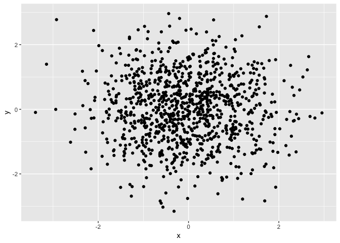
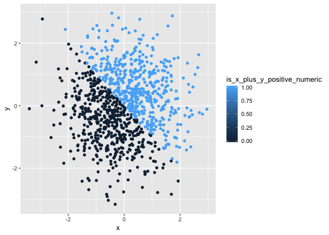
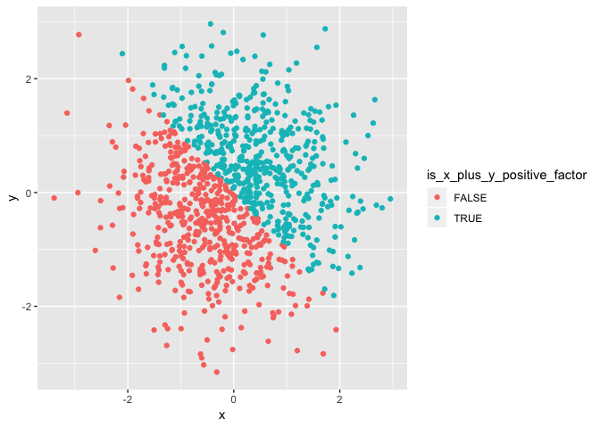

p8105\_hw1\_lishinkou
================
Shane

Problem 1
---------

``` r
p1_df = tibble(
  vec_numeric = runif(10, 0, 5),
  vec_logical = vec_numeric > 2,
  vec_char = letters[1:10],
  vec_factor = factor(rep(c('fac1', 'fac2'), 5))
)
mean(p1_df$vec_numeric)
```

    ## [1] 2.034611

``` r
mean(p1_df$vec_logical)
```

    ## [1] 0.5

``` r
mean(p1_df$vec_char)
```

    ## Warning in mean.default(p1_df$vec_char): argument is not numeric or
    ## logical: returning NA

    ## [1] NA

``` r
mean(p1_df$vec_factor)
```

    ## Warning in mean.default(p1_df$vec_factor): argument is not numeric or
    ## logical: returning NA

    ## [1] NA

Problem 2
---------

``` r
p2_df = tibble(
  x = rnorm(1000),
  y = rnorm(1000),
  is_x_plus_y_positive = x + y > 0,
  is_x_plus_y_positive_numeric = as.numeric(is_x_plus_y_positive),
  is_x_plus_y_positive_factor = as.factor(is_x_plus_y_positive)
)
```

p2\_df is a tibble of dataset of size 1000

``` r
ggplot(p2_df, aes(x = x, y = y)) + geom_point()
```



``` r
ggsave('p2_plot.pdf')
```

    ## Saving 7 x 5 in image

``` r
ggplot(p2_df, aes(x = x, y = y, color=is_x_plus_y_positive_numeric)) + geom_point()
```



``` r
ggplot(p2_df, aes(x = x, y = y, color=is_x_plus_y_positive_factor)) + geom_point()
```


